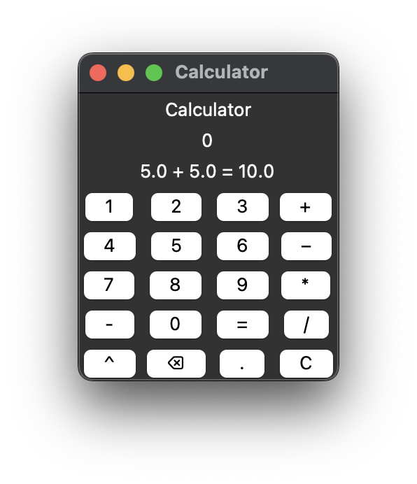

# cwc_calculator

notes:
- started with counter to get into tkinter
- took exactly three hours to get through both
- students appreciated implementing their own operators/functions, or coming up with new ones